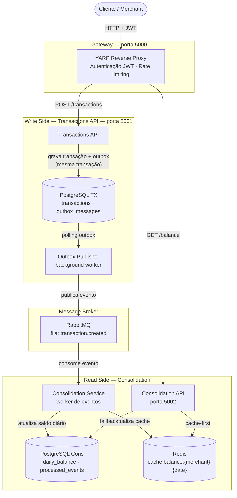
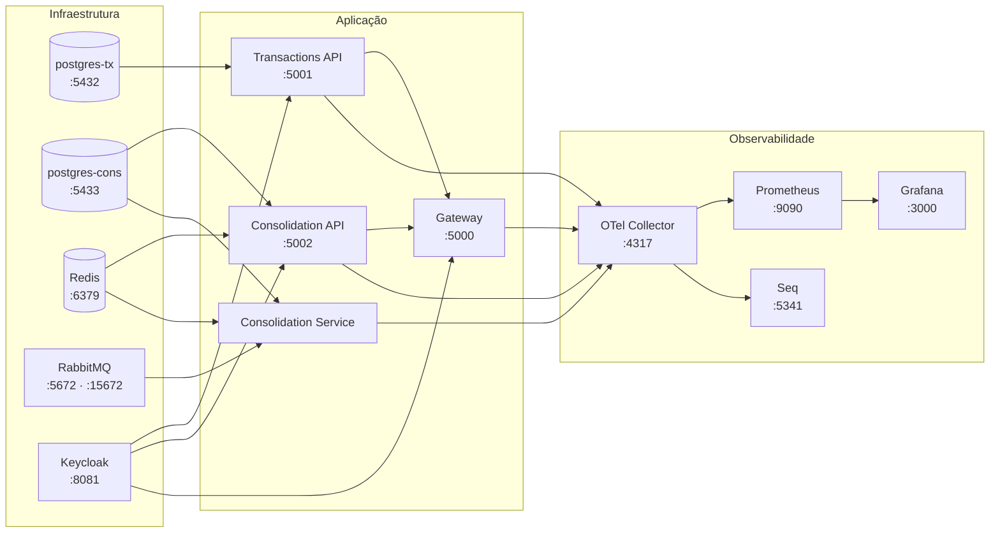
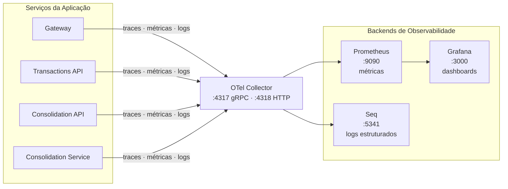

# Daily Cash Flow

[](LICENSE)
[](https://dotnet.microsoft.com/)
[](https://docs.docker.com/compose/)

> Sistema distribuído de Fluxo de Caixa Diário construído com arquitetura orientada a eventos, CQRS e padrão Outbox, seguindo princípios de Domain-Driven Design.

---

## Fluxo de Desenvolvimento

Este projeto segue um fluxo de desenvolvimento organizado, com tarefas priorizadas, rastreabilidade de progresso e histórico de decisões registrado via ADRs.

### Acompanhe o board do projeto

O planejamento, backlog e progresso das atividades estão disponíveis no GitHub Projects: **[Acessar o board do projeto](https://github.com/users/vldmatos/projects/3/views/1)**

### Acompanhe o histórico de commits

O histórico de commits na branch `main` reflete o progresso incremental do desenvolvimento: **[Ver histórico de commits](https://github.com/vldmatos/Daily-Cash-Flow/commits/main/)**

---

## Sumário

- [Sobre o Projeto](#sobre-o-projeto)
- [Como a Aplicação Funciona](#como-a-aplicação-funciona)
- [Stack Tecnológica](#stack-tecnológica)
- [Pré-requisitos](#pré-requisitos)
- [Como Rodar Localmente](#como-rodar-localmente)
- [Como Testar Manualmente](#como-testar-manualmente)
- [Serviços e Endpoints](#serviços-e-endpoints)
- [Observabilidade](#observabilidade)
- [Comandos Úteis de Operação](#comandos-úteis-de-operação)
- [Documentação](#documentação)
- [Fluxo de Desenvolvimento](#fluxo-de-desenvolvimento)
- [Licença](#licença)

---

## Sobre o Projeto

O **Daily Cash Flow** é um sistema backend distribuído que permite a lojistas (merchants) registrar débitos e créditos e consultar o saldo consolidado diário. O sistema foi desenhado para alta disponibilidade, rastreabilidade e consistência eventual, com separação explícita entre o lado de escrita (transações) e o lado de leitura (consolidação).

---

## Como a Aplicação Funciona

O fluxo principal segue um pipeline assíncrono, garantindo que nenhuma transação seja perdida mesmo em caso de falha temporária de componentes:



### Padrões arquiteturais aplicados

| Padrão | Onde é aplicado |
|---|---|
| **CQRS** | Separação entre Transactions API (write) e Consolidation API (read) |
| **Outbox Pattern** | Garantia de entrega at-least-once entre banco e RabbitMQ |
| **Event-Driven** | Comunicação assíncrona via RabbitMQ entre serviços |
| **Cache-aside** | Redis como cache de saldo diário na Consolidation API |
| **Idempotency** | Chave de idempotência nas transações e deduplicação de eventos |

---

## Stack Tecnológica

| Camada | Tecnologia |
|---|---|
| Linguagem / Runtime | C# · .NET 10 |
| APIs | ASP.NET Core Web API (Minimal APIs) |
| Workers | .NET Worker Service |
| Gateway | YARP Reverse Proxy |
| Banco de dados (write) | PostgreSQL 16 + EF Core + Npgsql |
| Banco de dados (read) | PostgreSQL 16 + Dapper |
| Cache | Redis 7 |
| Mensageria | RabbitMQ 3.13 + MassTransit |
| Identidade | Keycloak 23 (OAuth2 / JWT) |
| Observabilidade | OpenTelemetry · Prometheus · Grafana · Seq |
| Testes | xUnit · FluentAssertions · Testcontainers |
| Containerização | Docker · Docker Compose |

---

## Pré-requisitos

Antes de rodar o projeto localmente, certifique-se de ter instalado:

- [Docker Desktop](https://www.docker.com/products/docker-desktop/) (versão 25 ou superior)
- [Docker Compose](https://docs.docker.com/compose/) (incluído no Docker Desktop)
- [Git](https://git-scm.com/)

> As aplicações .NET são compiladas dentro dos próprios containers via Dockerfile multi-stage. Não é necessário ter o SDK do .NET instalado para rodar via Docker Compose.

---

## Como Rodar Localmente

### 1. Clone o repositório

```bash
git clone https://github.com/vldmatos/Daily-Cash-Flow.git
cd Daily-Cash-Flow
```

### 2. Suba toda a stack com um único comando

```bash
docker compose -f infra/docker-compose.yml up -d
```

Este comando inicializa, na ordem correta de dependências:



> A primeira execução pode levar alguns minutos, pois as imagens precisam ser baixadas e os serviços de aplicação precisam ser compilados.

### 3. Verifique que todos os serviços estão saudáveis

```bash
docker compose -f infra/docker-compose.yml ps
```

Todos os serviços com healthcheck devem exibir o status `healthy`.

### 4. Acesse os serviços

Consulte a seção [Serviços e Endpoints](#serviços-e-endpoints) abaixo.

### 5. Para encerrar e limpar volumes

```bash
# Apenas parar os containers (mantém volumes/dados)
docker compose -f infra/docker-compose.yml down

# Parar e remover todos os volumes (ambiente limpo)
docker compose -f infra/docker-compose.yml down -v
```

---

## Como Testar Manualmente

Você pode validar o sistema de duas formas: via Swagger (rápido para explorar endpoints) e via Postman (fluxo mais real passando pelo Gateway).

### 1. Acesse as aplicações de suporte

- Keycloak: `http://localhost:8081`
- Transactions Swagger: `http://localhost:5001/swagger`
- Consolidation Swagger: `http://localhost:5002/swagger`
- Gateway: `http://localhost:5000`
- RabbitMQ UI: `http://localhost:15672`

### 2. Gere um token JWT no Keycloak

Use o endpoint:

`POST http://localhost:8081/realms/cashflow/protocol/openid-connect/token`

Com body `x-www-form-urlencoded`:

- `grant_type=password`
- `client_id=cashflow-frontend`
- `username=merchant1`
- `password=merchant1`

Exemplo com curl:

```bash
curl --location "http://localhost:8081/realms/cashflow/protocol/openid-connect/token" \
--header "Content-Type: application/x-www-form-urlencoded" \
--data-urlencode "grant_type=password" \
--data-urlencode "client_id=cashflow-frontend" \
--data-urlencode "username=merchant1" \
--data-urlencode "password=merchant1"
```

Copie o valor de `access_token`.

### 3. Teste via Swagger (em cada API)

1. Abra `http://localhost:5001/swagger` (Transactions API).
2. Clique em **Authorize** e informe: `Bearer SEU_ACCESS_TOKEN`.
3. Execute `POST /transactions/` com payload:

```json
{
  "type": "Credit",
  "amount": 150.75,
  "occurredOn": "2026-04-28T12:00:00Z",
  "currency": "BRL",
  "description": "Venda teste"
}
```

4. Envie também o header `Idempotency-Key: test-001`.
5. Guarde o `id` retornado e valide:
   - `GET /transactions/{id}`
   - `POST /transactions/{id}/reverse` (opcional)

Depois, abra `http://localhost:5002/swagger` e repita o **Authorize** com o mesmo token para testar:

- `GET /balance/{merchantId}?date=2026-04-28`
- `GET /balance/{merchantId}/range?from=2026-04-01&to=2026-04-28`

Use este `merchantId` para `merchant1`:

`550e8400-e29b-41d4-a716-446655440001`

### 4. Teste via Postman (fluxo via Gateway)

Configure o header em todas as requisições:

`Authorization: Bearer {{token}}`

#### 4.1 Criar transação

`POST http://localhost:5000/transactions/`

Headers:

- `Authorization: Bearer {{token}}`
- `Content-Type: application/json`
- `Idempotency-Key: test-001`

Body:

```json
{
  "type": "Credit",
  "amount": 150.75,
  "occurredOn": "2026-04-28T12:00:00Z",
  "currency": "BRL",
  "description": "Venda teste gateway"
}
```

#### 4.2 Consultar transação

`GET http://localhost:5000/transactions/{{transactionId}}`

#### 4.3 Consultar saldo diário

`GET http://localhost:5000/balance/550e8400-e29b-41d4-a716-446655440001?date=2026-04-28`

#### 4.4 Consultar saldo por período

`GET http://localhost:5000/balance/550e8400-e29b-41d4-a716-446655440001/range?from=2026-04-01&to=2026-04-28`

### 5. Checklist de validação

- Sem token, endpoints de negócio devem retornar `401`.
- Criação de transação deve retornar `201`.
- Consulta da transação deve retornar `200`.
- Saldo deve refletir o evento após processamento assíncrono.
- Requisição repetida com mesma `Idempotency-Key` não deve duplicar transação.

### 6. Diagnóstico rápido (se algo falhar)

```bash
docker compose -f infra/docker-compose.yml logs -f
docker compose -f infra/docker-compose.yml logs -f gateway
docker compose -f infra/docker-compose.yml logs -f transactions-api
docker compose -f infra/docker-compose.yml logs -f consolidation-service
docker compose -f infra/docker-compose.yml logs -f consolidation-api
```

---

## Serviços e Endpoints

### APIs da aplicação

| Serviço | URL local | Descrição |
|---|---|---|
| **Gateway** | http://localhost:5000 | Ponto de entrada único. Roteia para Transactions e Consolidation APIs com autenticação JWT |
| **Transactions API** | http://localhost:5001 | Criação, consulta e estorno de transações (write model) |
| **Consolidation API** | http://localhost:5002 | Consulta de saldo diário consolidado (read model) |

#### Principais rotas via Gateway

| Método | Rota | Descrição |
|---|---|---|
| `POST` | `/transactions` | Registra um débito ou crédito |
| `GET` | `/transactions/{id}` | Consulta uma transação por ID |
| `DELETE` | `/transactions/{id}` | Estorna uma transação |
| `GET` | `/balance/{merchantId}/{date}` | Saldo diário de um lojista em uma data |
| `GET` | `/balance/{merchantId}?from=&to=` | Saldo por faixa de datas |

### Infraestrutura

| Serviço | URL local | Credenciais padrão |
|---|---|---|
| **RabbitMQ Management** | http://localhost:15672 | `guest` / `guest` |
| **Keycloak Admin** | http://localhost:8081 | `admin` / `admin` |
| **Grafana** | http://localhost:3000 | `admin` / `admin` |
| **Prometheus** | http://localhost:9090 | — |
| **Seq (logs)** | http://localhost:5341 | — |
| **PostgreSQL (TX)** | `localhost:5432` | db: `cashflow_tx` · user: `cashflow` |
| **PostgreSQL (Cons)** | `localhost:5433` | db: `cashflow_cons` · user: `cashflow` |
| **Redis** | `localhost:6379` | — |

---

## Observabilidade

A stack de observabilidade é iniciada automaticamente com o Docker Compose e não requer configuração adicional.



- **Grafana** (http://localhost:3000): dashboards pré-provisionados com métricas de latência, throughput e saúde dos serviços.
- **Seq** (http://localhost:5341): logs estruturados de todos os serviços, com correlação por `TraceId`.
- **Prometheus** (http://localhost:9090): coleta de métricas via OpenTelemetry Collector.

O `TraceId` gerado pelo OpenTelemetry permite rastrear uma requisição de ponta a ponta: do Gateway até o RabbitMQ e o Consolidation Service.

---

## Comandos Úteis de Operação

```bash
# Acompanhar logs em tempo real de todos os serviços
docker compose -f infra/docker-compose.yml logs -f

# Logs de um serviço específico
docker compose -f infra/docker-compose.yml logs -f transactions-api
docker compose -f infra/docker-compose.yml logs --tail=200 consolidation-service

# Reiniciar um serviço
docker compose -f infra/docker-compose.yml restart transactions-api

# Escalar o Consolidation Service (processamento paralelo de eventos)
docker compose -f infra/docker-compose.yml up -d --scale consolidation-service=4

# Verificar status dos containers
docker compose -f infra/docker-compose.yml ps

# Acessar o banco de transações
docker compose -f infra/docker-compose.yml exec postgres-tx \
  psql -U cashflow -d cashflow_tx

# Verificar o cache Redis
docker compose -f infra/docker-compose.yml exec redis redis-cli keys "balance:*"
```

---

## Documentação

A pasta [`docs/`](docs/) contém toda a documentação técnica do projeto, organizada por domínio:

### Arquitetura

| Documento | Descrição |
|---|---|
| [C4 — Contexto](docs/architecture/c4-context.md) | Visão de alto nível: sistema, atores e dependências externas |
| [C4 — Container](docs/architecture/c4-container.md) | Containers (serviços, bancos, mensageria) e suas interações |
| [C4 — Component](docs/architecture/c4-component.md) | Componentes internos de cada container |
| [Deploy](docs/architecture/deployment.md) | Topologias de deploy: Local, Staging e Produção (Kubernetes) |

### Architecture Decision Records (ADRs)

Registro das principais decisões arquiteturais, com contexto, motivação e consequências:

| ADR | Decisão |
|---|---|
| [ADR-0001](docs/adr/0001-record-architecture-decisions.md) | Adoção do formato ADR para registrar decisões |
| [ADR-0002](docs/adr/0002-microservices-over-monolith.md) | Microserviços em vez de monolito |
| [ADR-0003](docs/adr/0003-event-driven-rabbitmq.md) | Comunicação assíncrona via RabbitMQ |
| [ADR-0004](docs/adr/0004-cqrs-read-write-split.md) | CQRS — separação leitura/escrita |
| [ADR-0005](docs/adr/0005-outbox-pattern.md) | Outbox Pattern para garantia de entrega |
| [ADR-0006](docs/adr/0006-postgres-for-transactions.md) | PostgreSQL como banco transacional |
| [ADR-0007](docs/adr/0007-redis-for-daily-balance.md) | Redis para cache do saldo diário |
| [ADR-0008](docs/adr/0008-opentelemetry-standard.md) | OpenTelemetry como padrão de observabilidade |
| [ADR-0009](docs/adr/0009-jwt-oauth2-keycloak.md) | JWT/OAuth2 com Keycloak para identidade |

### Domínio

| Documento | Descrição |
|---|---|
| [Bounded Contexts](docs/domain/bounded-contexts.md) | Delimitação dos contextos do domínio |
| [Business Capabilities](docs/domain/business-capabilities.md) | Capacidades de negócio mapeadas |
| [Ubiquitous Language](docs/domain/ubiquitous-language.md) | Glossário da linguagem ubíqua do domínio |

### Requisitos

| Documento | Descrição |
|---|---|
| [Requisitos Funcionais](docs/requirements/functional.md) | Casos de uso e regras de negócio |
| [Requisitos Não-Funcionais](docs/requirements/non-functional.md) | SLOs, escalabilidade e restrições de qualidade |

### Operação

| Documento | Descrição |
|---|---|
| [Runbook — Incident Response](docs/runbook/incident-response.md) | Procedimentos de resposta a incidentes em produção |

### Planejamento e Custos

| Documento | Descrição |
|---|---|
| [TCO — Estimativa de Custos](docs/costs/tco-estimate.md) | Estimativa total de custo de operação (TCO) |
| [Roadmap — Trabalhos Futuros](docs/roadmap/future-work.md) | Próximas evoluções planejadas |
| [Plano de Transição](docs/transition/transition-plan.md) | Estratégia de transição para produção |

---

## Licença

Este projeto está licenciado sob a [MIT License](LICENSE).
