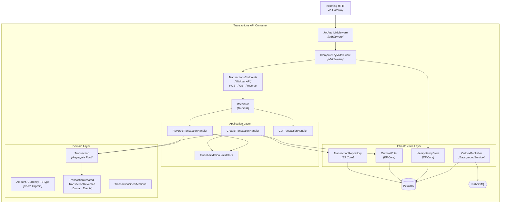
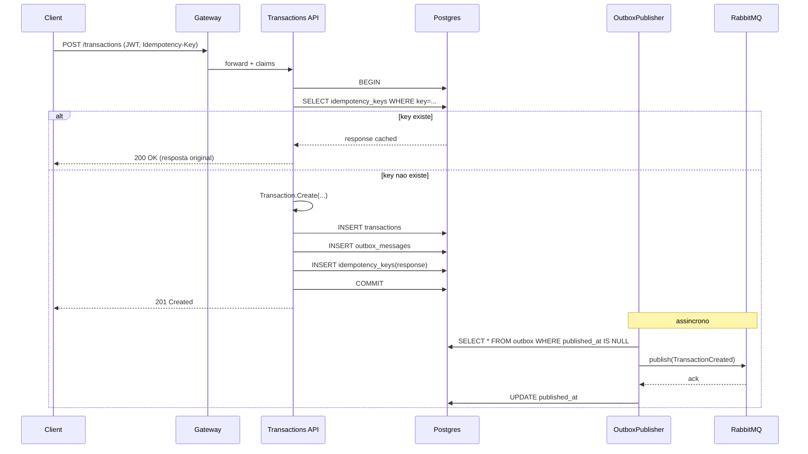
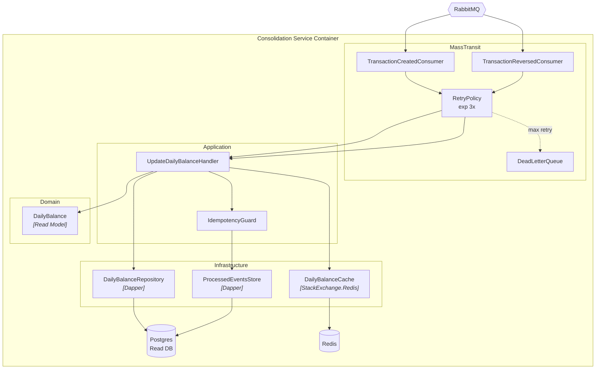
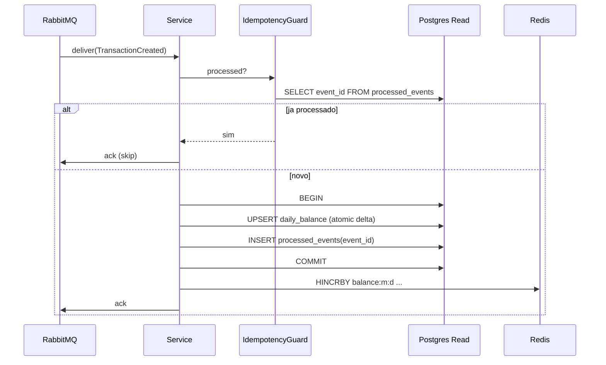
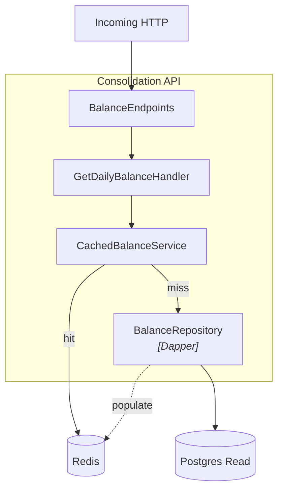

# C4 - Nivel 3: Componentes

> O diagrama de componentes abre um container especifico em seus componentes internos (classes/modulos). Mostramos os dois containers mais relevantes: **Transactions API** e **Consolidation Service**.

## Transactions API — Componentes

### Responsabilidades

| Componente | Responsabilidade |
|---|---|
| `TransactionsEndpoints` | Define rotas, mapeia DTOs, traduz excecoes para `ProblemDetails` |
| `JwtAuthMiddleware` | ASP.NET Core nativo + `[Authorize]` |
| `IdempotencyMiddleware` | Consulta `idempotency_keys`; se hit, retorna resposta armazenada |
| `CreateTransactionHandler` | Orquestra: valida, cria aggregate, persiste + outbox em transacao |
| `Transaction` (Aggregate) | Invariantes de dominio; metodos `Create()`, `Reverse()` |
| `Amount`, `Currency`, `TxType` | Value Objects imutaveis |
| `TransactionRepository` | Abstracao sobre EF Core `DbContext` |
| `OutboxWriter` | Escreve evento serializado na tabela `outbox_messages` na **mesma transacao** do aggregate |
| `OutboxPublisher` | `BackgroundService` que ponta a tabela outbox (polling a cada 500ms ou listen/notify) e publica no RabbitMQ com `publish confirms`, marcando como processado |
| `IdempotencyStore` | Repositorio de `idempotency_keys` com TTL 24h |

### Sequencia: criar lancamento

## Consolidation Service — Componentes

### Responsabilidades

| Componente | Responsabilidade |
|---|---|
| `TransactionCreatedConsumer` | Deserializa envelope, converte em comando interno |
| `RetryPolicy` | MassTransit: `UseMessageRetry(r => r.Exponential(...))` |
| `DeadLetterQueue` | Queue `*.dlq` + alert em Grafana |
| `UpdateDailyBalanceHandler` | Calcula delta, aplica em Postgres + Redis |
| `IdempotencyGuard` | Se `event_id` ja em `processed_events`, skip |
| `DailyBalance` (Read Model) | Value record com totais |
| `DailyBalanceRepository` | `UPSERT` em `daily_balance` (Postgres) |
| `DailyBalanceCache` | `HINCRBY balance:{m}:{d} total_credits <delta>` |

### Sequencia: consumir TransactionCreated

## Consolidation API — Componentes

**Politica cache-aside**:

1. GET na chave `balance:{m}:{d}`
2. Se hit: retornar
3. Se miss: consultar DB, popular cache com TTL 60s, retornar

## Principios de Design Aplicados

- **Dependency Inversion**: dominio nao conhece infra; interfaces em `Domain`, implementacoes em `Infrastructure`
- **Hexagonal Architecture** (Ports & Adapters): APIs sao adapters do dominio
- **Single Responsibility**: handlers fazem uma coisa (um command -> um handler)
- **Explicit Architecture**: dependencia de camadas visivel no grafo: API -> Application -> Domain <- Infrastructure
- **Command/Query Separation**: comandos nao retornam dados de dominio (apenas `Id` gerado); queries nao mutam
