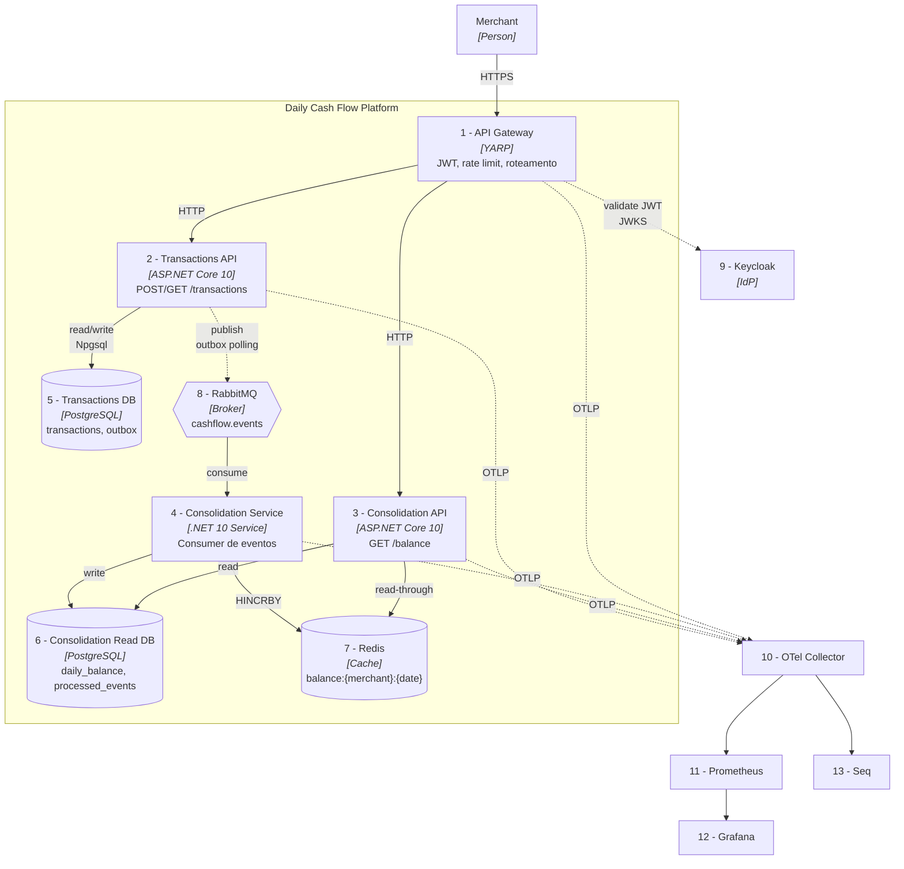

# C4 - Nivel 2: Containers

> O diagrama de containers abre a caixa "Daily Cash Flow" e mostra as aplicacoes/servicos deployaveis que a compoem. Cada container e uma unidade de deploy (processo, container Docker, etc).

## Containers

| # | Container | Responsabilidade | Stack | Porta (local) |
|---|---|---|---|---|
| 1 | API Gateway | Roteamento, JWT, rate limit, TLS termination | YARP (.NET 10) | 8080 |
| 2 | Transactions API | Write side: criar/estornar/consultar lancamento | ASP.NET Core 10 | 5001 |
| 3 | Consolidation API | Read side: consultar saldo diario | ASP.NET Core 10 | 5002 |
| 4 | Consolidation Service | Consome eventos e atualiza read model | .NET 10 Generic Host | - |
| 5 | Transactions DB | Write store + Outbox | PostgreSQL 16 | 5432 |
| 6 | Consolidation Read DB | Read model durable | PostgreSQL 16 | 5433 |
| 7 | Cache | Saldo diario O(1) | Redis 7 | 6379 |
| 8 | Message Broker | Fila de eventos de integracao | RabbitMQ 3.13 | 5672 / 15672 |
| 9 | Identity Provider | Emissao de JWT | Keycloak 23 | 8081 |
| 10 | OTel Collector | Recebe e distribui telemetria | OpenTelemetry Collector | 4317 |
| 11 | Prometheus | Coleta metricas | Prometheus 2.50 | 9090 |
| 12 | Grafana | Dashboards | Grafana 10 | 3000 |
| 13 | Seq | Logs estruturados | Seq | 5341 |

## Diagrama de Containers

## Responsabilidades Detalhadas

### 1. API Gateway (YARP)

- Unico ponto de entrada publico
- Termina TLS
- Valida JWT (issuer = Keycloak)
- Aplica rate limit (token bucket, 100 rps/token)
- Injeta `X-Correlation-Id` se ausente
- Rotas:
  - `/transactions/**` -> Transactions API
  - `/balance/**` -> Consolidation API
  - `/health` -> propria

### 2. Transactions API

- Dominio rico (agregado `Transaction`)
- Commands via MediatR + FluentValidation
- EF Core + PostgreSQL
- Outbox table (`outbox_messages`)
- Idempotencia (`idempotency_keys`)
- Expoe `/swagger`, `/health/live`, `/health/ready`, `/metrics`

### 3. Consolidation API

- Read-only
- Consulta Redis primeiro; fallback para Postgres read DB
- Dapper para queries otimizadas
- Cache TTL 60s (seguranca contra cache staleness extrema)

### 4. Consolidation Service

- MassTransit consumer registrado nas filas:
  - `consolidation.transaction.created`
  - `consolidation.transaction.reversed`
- Idempotencia: upsert em `processed_events(event_id)` antes de aplicar efeito
- Retry exponencial (3 tentativas, 2s/8s/32s) -> DLQ
- Atualiza Postgres (fonte durable) + Redis (cache quente) em ordem: primeiro DB, depois cache (read-through compensa eventual inconsistencia)

### 5/6. PostgreSQL (Write + Read)

- **Write DB** (`cashflow_tx`):
  - `transactions` (imutavel, apenas insert)
  - `outbox_messages` (publicados -> apagados / marcados)
  - `idempotency_keys` (TTL 24h via job de limpeza)
- **Read DB** (`cashflow_cons`):
  - `daily_balance` (PK: `merchantId, date`)
  - `processed_events` (PK: `event_id`, TTL via partitioning V1.1)

Bancos **fisicamente separados** para permitir scale independente e reduzir contencao.

### 7. Redis

- Key pattern: `balance:{merchantId}:{yyyy-MM-dd}`
- Operacoes: `HSET`, `HINCRBY`, `HGETALL`
- Persistencia: AOF ligado (seguranca adicional; Postgres ainda e a fonte da verdade)
- TTL: 72h (saldos antigos recalculam sob demanda)

### 8. RabbitMQ

- Exchange: `cashflow.events` (topic)
- Queues: `consolidation.transaction.created`, `consolidation.transaction.reversed`
- Durable + manual ack + DLQ (`*.dlq`)
- Prefetch: 10 (balanceio throughput vs. reprocessamento em caso de crash)

### 9. Keycloak

- Realm: `cashflow`
- Clients: `cashflow-api` (confidential), `cashflow-frontend` (public, PKCE)
- Custom claim: `merchantId` (propagado no JWT)

### 10-13. Observabilidade

- **OTel Collector**: recebe OTLP (4317 gRPC, 4318 HTTP) e exporta:
  - Metrics -> Prometheus (pull)
  - Logs -> Seq
  - Traces -> Seq (pipeline dedicado)
- **Prometheus**: scrape 15s
- **Grafana**: datasources pre-provisionados, 4 dashboards
- **Seq**: logs + traces, retencao 90 dias

## Comunicacao Entre Containers

| De | Para | Protocolo | Sincronia | Observacao |
|---|---|---|---|---|
| Client | Gateway | HTTPS | sync | TLS 1.2+ |
| Gateway | APIs | HTTP/2 | sync | rede privada |
| APIs | Postgres | TCP/Npgsql | sync | pool de 50 conns |
| APIs | Redis | TCP/RESP | sync | multiplexer unico |
| Tx API | RabbitMQ | AMQP 0.9.1 | async | publish confirms |
| RabbitMQ | Service | AMQP 0.9.1 | async | manual ack |
| Todos | OTel | OTLP gRPC | async | fire-and-forget |

## Capacidades Nao-Funcionais por Container

| Container | HA strategy | RTO | RPO |
|---|---|---|---|
| Gateway | >=2 replicas stateless | < 30s | 0 |
| Transactions API | >=2 replicas | < 30s | 0 |
| Consolidation API | >=2 replicas | < 30s | 0 (eventual) |
| Service | >=2 replicas (consumers concorrentes) | < 60s | <=30s backlog |
| Postgres | streaming replication (V1.1) | 5 min | <=1min |
| Redis | AOF + sentinel (V1.1) | 5 min | <=1s |
| RabbitMQ | cluster 3 nos (V1.1) | 2 min | 0 (durable) |

## Proximos Niveis

Para abrir cada container em seus componentes internos, ver [c4-component.md](c4-component.md).
