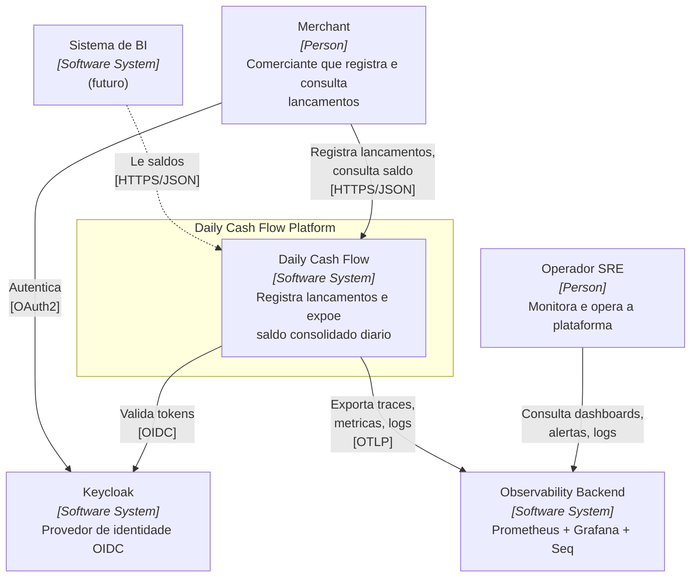

# C4 - Nivel 1: Contexto do Sistema

> O diagrama de contexto mostra **o sistema como uma caixa preta** e seus atores e sistemas externos. E a visao que voce mostra para um executivo.

## Atores

| Ator | Tipo | Motivacoes |
|---|---|---|
| **Merchant** (Comerciante) | Humano (via app/portal) ou API client | Registrar movimentacoes e acompanhar saldo diario |
| **Operador SRE** | Humano interno | Monitorar saude, responder a incidentes |
| **Sistema de BI/Analytics** | Software externo (futuro) | Consumir saldos consolidados para relatorios corporativos |

## Diagrama de Contexto

## Fluxos Chave (nivel de negocio)

### Fluxo A — Registrar lancamento

1. Merchant autentica no Keycloak -> recebe JWT
2. Merchant envia `POST /transactions` para Daily Cash Flow com JWT
3. Daily Cash Flow valida token, registra o lancamento e responde `201`
4. (Assincrono) Daily Cash Flow processa internamente o consolidado

### Fluxo B — Consultar saldo

1. Merchant autentica (ou reaproveita JWT)
2. Merchant envia `GET /balance/{merchantId}?date=...`
3. Daily Cash Flow valida token + autorizacao (merchant so ve seu saldo) e retorna `200`

## Premissas e Restricoes

| # | Tipo | Descricao |
|---|---|---|
| A1 | Premissa | Merchants tem conectividade estavel HTTPS |
| A2 | Premissa | Cada merchant tem um `merchantId` unico criado no Keycloak |
| A3 | Restricao | Moeda unica BRL (V1) |
| A4 | Restricao | Nao existe integracao com conciliacao bancaria (V1) |
| A5 | Premissa | Fuso horario UTC em todas as datas (V1) |

## Relacionamento com Proximos Niveis

Para abrir a caixa "Daily Cash Flow", ver [c4-container.md](c4-container.md) (nivel 2).
