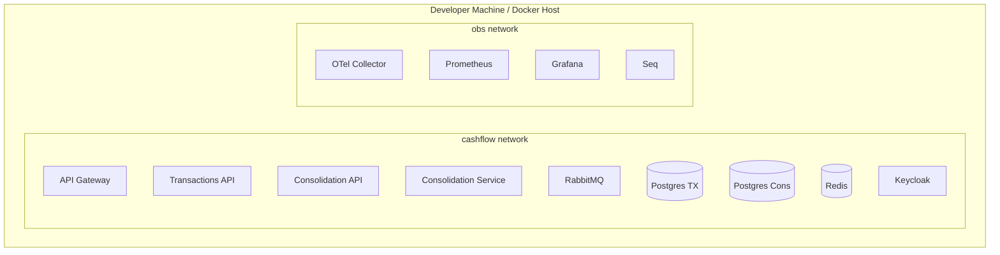
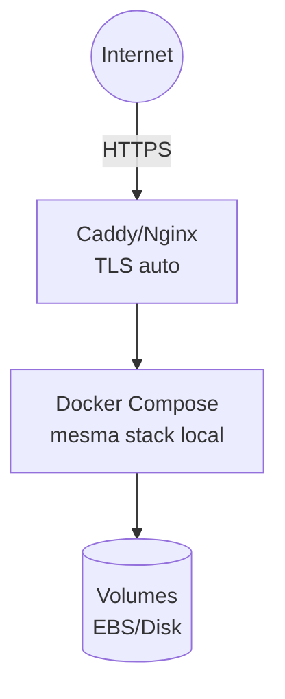
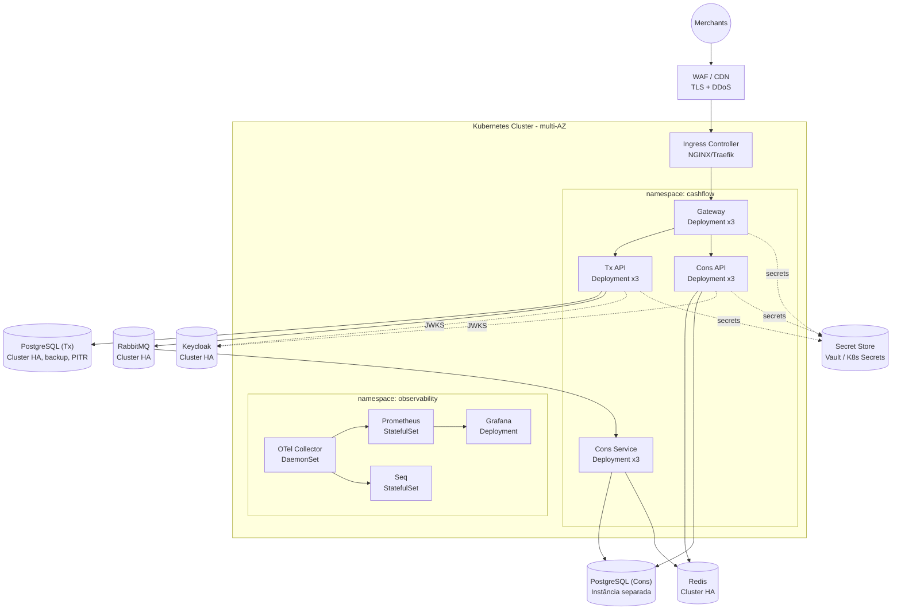
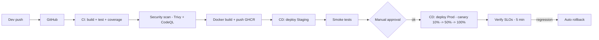

# Deployment

> Topologia fisica de deploy em 3 cenarios: **Local**, **Staging (single VM)** e **Producao (cloud-native)**.

## Cenario 1 — Local (desenvolvimento)

Docker Compose em uma maquina do desenvolvedor. Objetivo: 1 comando e tudo sobe.



**Comandos**:

```bash
docker compose -f infra/docker-compose.yml up -d     # sobe tudo
docker compose -f infra/docker-compose.yml logs -f   # logs
docker compose -f infra/docker-compose.yml down -v   # limpa
```

**Volumes persistentes** (mapeados em `./data/` no repo):

- `postgres-tx-data`
- `postgres-cons-data`
- `redis-data`
- `rabbitmq-data`
- `keycloak-data`
- `grafana-data`
- `seq-data`

## Cenario 2 — Staging (single VM)

Um droplet/EC2/VM Azure de porte medio (4 vCPU, 16 GB) com o mesmo `docker-compose.yml` + reverse proxy Caddy/Nginx com TLS automatico (Let's Encrypt).

Nao ha HA nesse cenario, e proposital para reduzir custo em ambiente de testes.



**Diferencas vs. local**:

- `ASPNETCORE_ENVIRONMENT=Staging`
- Secrets via `.env` injetado pelo provisionador (Ansible/Terraform)
- Backup diario de volumes (cron + `pg_dump`)
- Retencao de logs Seq: 30 dias (local: 7)

## Cenario 3 — Producao (Kubernetes cloud-native)

Target: **Kubernetes Cluster** com recursos em Alta Disponibilidade (HA) para os componentes de infraestrutura.



### Principais diferenças vs. local

| Componente | Local | Produção | Motivo |
|---|---|---|---|
| RabbitMQ | Single node | **RabbitMQ Cluster (HA)** | Alta disponibilidade, tolerância a falhas (ADR-0003) |
| PostgreSQL | Container simples | **PostgreSQL Cluster** (2 instâncias) | Instâncias separadas para Tx e Cons, replicação, PITR (ADR-0006) |
| Redis | Container simples | **Redis Cluster / Sentinel** | Alta disponibilidade, persistência (ADR-0007) |
| Observabilidade | Containers simples | **Prometheus + Grafana + Seq (HA)** | Retenção escalável, storage persistente (ADR-0008) |
| Identidade | Container simples | **Keycloak Cluster (HA)** | Escalabilidade e alta disponibilidade (ADR-0009) |
| Ingress | N/A | **WAF + Ingress Controller** | Segurança edge, TLS, rate limiting |
| Secrets | `.env` / `user-secrets` | **Vault / Kubernetes Secrets** | Rotação automática, segurança |


### Pipeline de Deploy (producao)



### Estrategia de Rollout

- **Canary**: 10% -> 50% -> 100% com intervalos de 5 min
- **Rollback automatico** se:
  - Error rate > 2% durante 2 min
  - Latencia p95 > 2x baseline durante 2 min
- **Feature flags** (OpenFeature/Flagsmith, futuro) para rollback logico sem redeploy

### Recursos e Limites (producao inicial)

| Deployment | Replicas | CPU req/limit | Mem req/limit | HPA |
|---|---|---|---|---|
| Gateway | 3 | 250m/1000m | 256Mi/512Mi | CPU 60% |
| Tx API | 3-10 | 500m/2000m | 512Mi/1Gi | CPU 60% + RPS |
| Cons API | 3-10 | 500m/2000m | 512Mi/1Gi | CPU 60% + RPS |
| Cons Service | 3-8 | 500m/1000m | 512Mi/1Gi | queue depth |

### Estrategias de Seguranca Adicionais (producao)

- Network policies (deny-all default, whitelist por namespace)
- PodSecurityPolicy / Gatekeeper (no-privileged, read-only root fs)
- mTLS no mesh (Linkerd/Istio, V2)
- Secret rotation automatico (Vault + reloader)
- WAF regras OWASP CRS via Front Door

## DR - Disaster Recovery

| Cenario | RTO | RPO | Estrategia |
|---|---|---|---|
| Pod crash | < 10s | 0 | Kubernetes restart |
| Node failure | < 60s | 0 | Multi-AZ scheduling |
| Region failure | < 30 min | < 1 min | Postgres geo-backup + failover manual para regiao secundaria |
| Data corruption | varia | <= 5 min (PITR) | Postgres Point-in-Time Restore |

Runbook detalhado em [runbook/incident-response.md](../runbook/incident-response.md).
