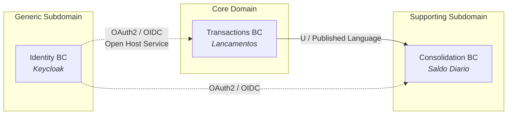
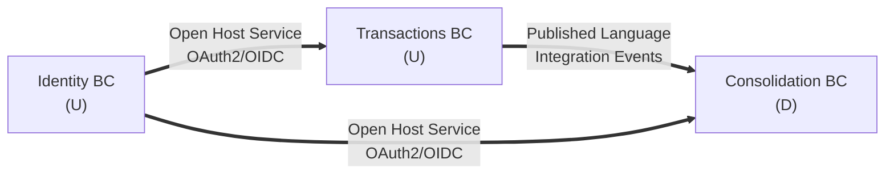

# Bounded Contexts e Context Map

## Visao Estrategica

Aplicando [Strategic DDD](https://www.domainlanguage.com/ddd/), identificamos 3 bounded contexts. Cada um possui seu proprio modelo, vocabulario e ritmo de evolucao.

Legenda: `U` = Upstream (quem define o contrato), `D` = Downstream (quem consome).

## Classificacao dos Subdominios

| BC | Subdominio | Justificativa | Estrategia |
|---|---|---|---|
| Transactions | **Core** | Unica fonte da verdade das movimentacoes; diferencial competitivo (integridade, auditoria). | Maior investimento em qualidade, DDD tatico rigoroso, testes exaustivos. |
| Consolidation | **Supporting** | Necessario para UX mas e derivado de Transactions. Pode ser reconstruido a partir dos eventos. | Simples, otimizado para leitura, reconstrutivel a qualquer momento. |
| Identity | **Generic** | Problema resolvido pelo mercado. Comprar > Construir. | Keycloak off-the-shelf. Nao investir tempo. |

## Transactions Bounded Context

### Propositos
- Registrar lancamentos com garantias ACID e auditabilidade
- Prevenir duplicidade via idempotency key
- Publicar eventos de dominio para downstream

### Dentro do contexto
- Agregados: `Transaction`
- Entidades: `Transaction`
- Value Objects: `Amount`, `Currency`, `TransactionType`, `IdempotencyKey`
- Servicos de dominio: `TransactionFactory`
- Invariantes:
  - `amount > 0`
  - `type in {Credit, Debit}`
  - `occurredOn <= now + 5min`
  - Unicidade de `(merchantId, idempotencyKey)` nas ultimas 24h
- Repositorios: `ITransactionRepository`
- Eventos de dominio: `TransactionCreated`, `TransactionReversed`

### Fora do contexto
- Calculo de saldo (e do Consolidation)
- Autenticacao (e do Identity)
- Listagem historica paginada com filtros complexos (fora do escopo V1)

## Consolidation Bounded Context

### Propositos
- Prover leitura eficiente (< 300ms p95) do saldo diario
- Agregar lancamentos por (merchant, day)
- Servir como fonte de dashboards e relatorios

### Dentro do contexto
- Read Model: `DailyBalance` (merchantId, date, totalCredits, totalDebits, balance, transactionCount, lastUpdatedAt)
- Consumers: `TransactionCreatedHandler`, `TransactionReversedHandler`
- Idempotencia via tabela `processed_events(event_id)`
- Estrategia de cache: Redis HSET por chave `balance:{merchantId}:{yyyy-MM-dd}`

### Fora do contexto
- Mutacao de lancamentos (read-only)
- Rebalance/fechamento contabil formal (dominio distinto; futuro)

## Identity Bounded Context

### Propositos
- Autenticacao (quem e voce)
- Autorizacao coarse-grained via claims (role=merchant, merchantId=...)

### Implementacao
- Keycloak (OSS), realm `cashflow`, client `cashflow-api`
- JWT RS256, TTL 15 min, refresh token 24h
- Nao ha codigo proprio neste BC — configuracao declarativa em `infra/keycloak/realm.json`

## Context Map — Padroes de Relacionamento

### Transactions -> Consolidation

- **Padrao**: Customer/Supplier + Published Language
- **Contrato**: eventos versionados em `CashFlow.Shared.Contracts` (v1)
- **Formato**: JSON com envelope (`eventId`, `eventType`, `eventVersion`, `occurredAt`, `data`)
- **Transporte**: RabbitMQ topic exchange `cashflow.events` com routing keys `transaction.created`, `transaction.reversed`
- **Conformance Level**: Downstream **aceita** o formato do Upstream (Conformist). Em troca, ganha simplicidade e performance.

### Identity -> (Transactions | Consolidation)

- **Padrao**: Open Host Service (OAuth2/OIDC) + Anti-Corruption Layer (middleware JWT nos APIs)
- **Contrato**: JWT com claims padrao + customizadas (`merchantId`)
- **Evolucao**: se Keycloak for trocado (ex: Auth0), apenas o ACL muda — BCs de negocio nao sabem

## Quando dividir em mais BCs?

Gatilhos que justificariam criar um novo BC no futuro:

- **Reconciliacao contabil** com regras fiscais (entidade legal, NF-e, apuracao de impostos) -> novo BC `Accounting`
- **Relatorios analiticos** com janelas customizadas, BI, cohort -> novo BC `Analytics` em lakehouse separado
- **Notificacoes** (email/SMS quando saldo cruza limites) -> novo BC `Notifications`