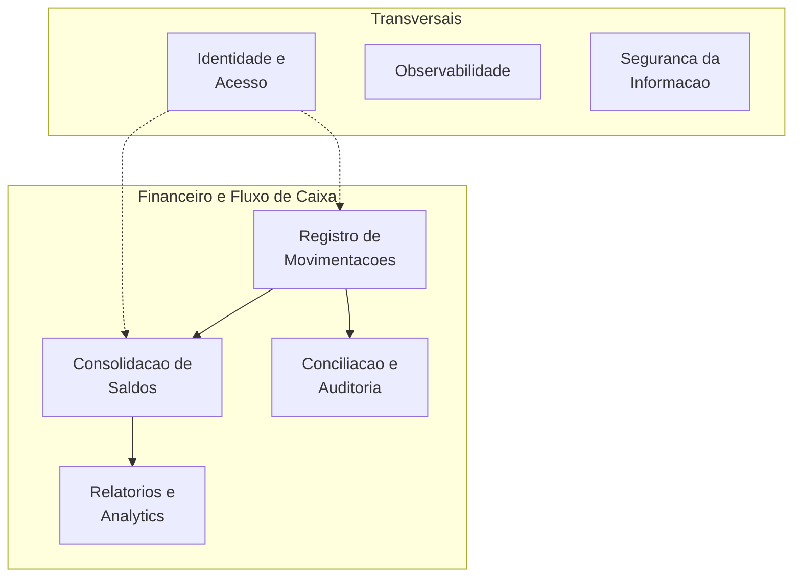

# Capacidades de Negocio

> Capacidade de negocio = "o que" a organizacao faz (nao "como"). Imutavel no curto prazo. Mapeada a partir do objetivo.

## Mapa de Capacidades (L1 - visao macro)

## Capacidades no Escopo do Desafio

| Capacidade | Em escopo? | Entregue por |
|---|---|---|
| Registro de Movimentacoes | **Sim** | Transactions BC |
| Consolidacao de Saldos | **Sim** | Consolidation BC |
| Identidade e Acesso | **Sim (basico)** | Identity BC (Keycloak) |
| Observabilidade | **Sim** | OTel + Prometheus + Grafana + Seq |
| Seguranca da Informacao | **Sim** | JWT + HTTPS + rate limit + input validation |
| Conciliacao e Auditoria | **Nao (V2+)** | - |
| Relatorios e Analytics | **Nao (V2+)** | - |

## Decomposicao L2 — Registro de Movimentacoes

| Sub-capacidade | Responsavel | Owner |
|---|---|---|
| Criar lancamento (credit/debit) | `POST /transactions` | Transactions API |
| Garantir idempotencia | Middleware + unique index | Transactions Infra |
| Validar regras de negocio | Agregado `Transaction` | Transactions Domain |
| Estornar lancamento | `POST /transactions/{id}/reverse` | Transactions API |
| Persistir auditavel | PostgreSQL + append-only | Transactions Infra |
| Publicar eventos | Outbox + MassTransit | Transactions Infra |

## Decomposicao L2 — Consolidacao de Saldos

| Sub-capacidade | Responsavel | Owner |
|---|---|---|
| Consumir eventos de Transactions | MassTransit consumer | Consolidation Service |
| Garantir processamento idempotente | Tabela `processed_events` | Consolidation Infra |
| Manter saldo diario em cache | Redis HSET + HINCRBY | Consolidation Infra |
| Manter saldo diario durable | Postgres read DB | Consolidation Infra |
| Servir saldo diario | `GET /balance/...` | Consolidation API |
| Reconstrucao a partir de eventos | Replay job (V1.1) | Consolidation Service |

## Alinhamento Capacidades x Bounded Contexts x Arquitetura

| Capacidade | BC | Container | Tecnologia |
|---|---|---|---|
| Registro de Movimentacoes | Transactions | `CashFlow.Transactions.Api` | .NET 10, EF Core, Postgres |
| Consolidacao | Consolidation | `CashFlow.Consolidation.Service` + `.Api` | .NET 10, MassTransit, Redis, Postgres |
| Identidade | Identity | Keycloak (externo) | Keycloak 23, OIDC |
| Observabilidade | — (transversal) | `otel-collector`, `prometheus`, `grafana`, `seq` | OTel, Prom, Grafana |
| Seguranca | — (transversal) | `CashFlow.Gateway` (YARP) | YARP, rate limit, JWT bearer |

## Heatmap de Investimento

| Capacidade | Investimento | Motivo |
|---|---|---|
| Registro de Movimentacoes | **Alto** | Core domain; corrompeu aqui = corrompeu tudo |
| Consolidacao | Medio | Reconstrutivel a partir de eventos |
| Identidade | Baixo | Usar pronto (Keycloak) |
| Observabilidade | Alto | Imprescindivel em producao; exigido pelo desafio |
| Seguranca | Alto | Requisito regulatorio (LGPD) e do desafio |

## Relacao com Requisitos Nao-Funcionais

| Capacidade | NFR Mais Relevante |
|---|---|
| Registro | Disponibilidade 99.9%, durabilidade 100% (RPO=0) |
| Consolidacao | Throughput 50 req/s (95% sucesso), latencia p95 300ms |
| Observabilidade | MTTR < 30 min, 100% de requests com traceId |
| Seguranca | Autenticacao obrigatoria, rate limit 100 req/s/token |
