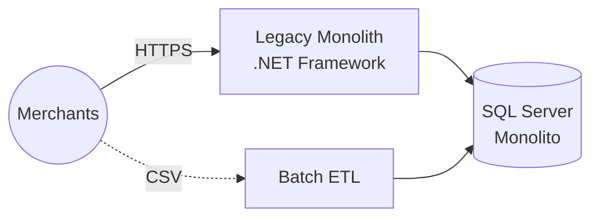
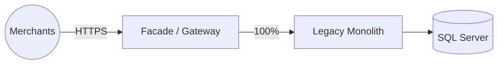
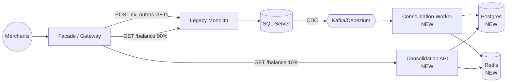
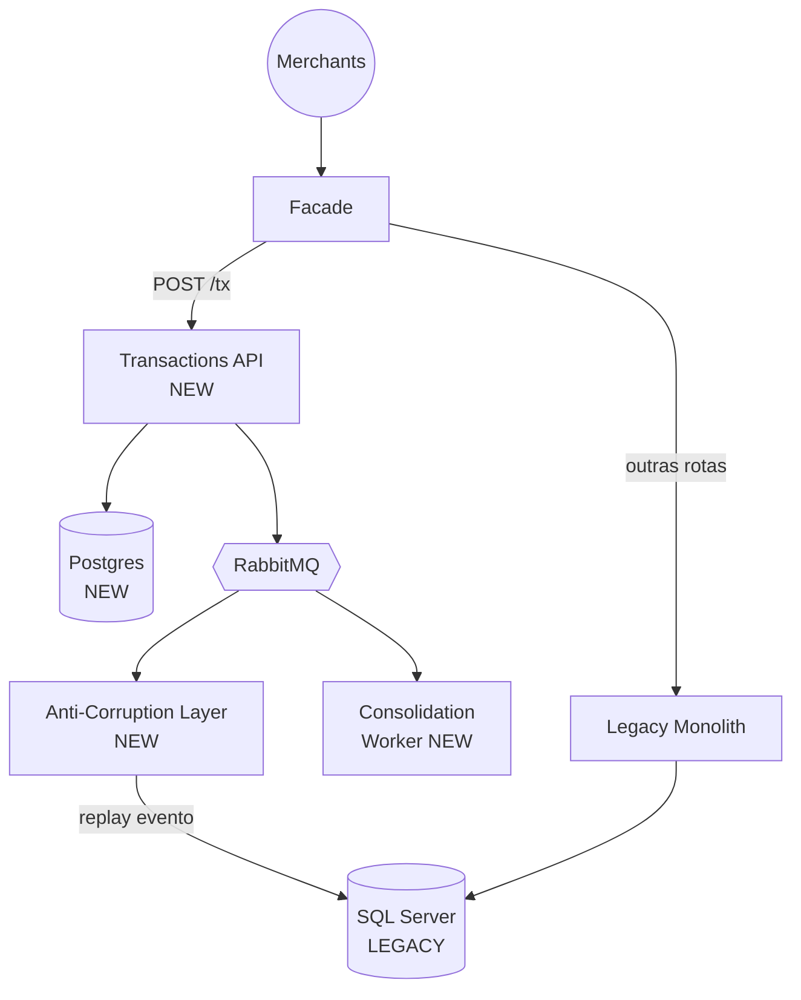
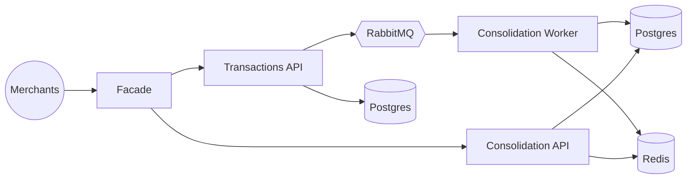

# Arquitetura de Transicao

> Descrevemos aqui um cenario de como a **Daily Cash Flow Platform** substituiria um sistema legado em producao, com risco controlado.

## Cenario Hipotetico

Assuma que existe hoje um **sistema legado** monolitico que faz controle de fluxo de caixa para varios merchants. Caracteristicas tipicas:

- Aplicacao monolitica em **.NET Framework 4.8** (ou Java 7, ou mainframe COBOL, o padrao se aplica)
- Banco **SQL Server** unico e gigante, com stored procedures entrelacadas
- UI web server-rendered (WebForms ou JSF)
- Integracoes via **arquivos batch** (CSV noturnos) ou servicos SOAP
- **Milhares de merchants** dependem dele
- Downtime > 5 min ja causa reclamacao massiva

Nao podemos simplesmente "desligar o antigo e ligar o novo" (Big Bang). Risco inaceitavel.

## Padrao Escolhido

Substituição das implementações menos impactantes para mais impactantes, implementando as novas e desativando as implementações antigas, através de padrões.

1. Colocamos um **facade/proxy** na frente do legado
2. Construimos **capacidades novas** no sistema moderno
3. O facade **redireciona** gradativamente trafego do legado para o novo
4. Quando 100% do trafego foi migrado, **desligamos** o legado

## Fases Propostas

### Fase 0 — Baseline (estado atual)

### Fase 1 — Introducao do Facade (0% migrado)

Colocamos um **API Gateway** (YARP) na frente. Todos os requests passam por ele, mas ele roteia 100% para o legado. Nesta fase:

- Zero risco: comportamento identico ao atual
- Ganhamos um ponto de observabilidade (gateway loga tudo)
- Ganhamos capacidade de **switching rapido** (traffic management)

### Fase 2 — Primeira Capacidade Nova (read-only)

Migramos primeiro o que e **mais seguro**: a **consulta de saldo diario consolidado**. E idempotente, read-only e a parte menos critica.

Construimos o novo servico `Consolidation` que:

- Le eventos **do legado** via **Change Data Capture (CDC)** no SQL Server (Debezium) ou via polling na tabela de lancamentos
- Constroi seu proprio read model (Postgres + Redis) em paralelo
- Expoe `GET /balance/...`

O facade comeca a rotear `GET /balance` para o **novo servico**, mas mantem o legado como fallback/canary.

Estrategia de canary: 10% -> 50% -> 100% por `merchantId` hash. Comparacao **shadow** (request e enviada para os dois e comparamos respostas) para pegar discrepancias sem afetar usuario.

**Criterios para avancar de % para %**:

- `error_rate_new <= error_rate_legacy`
- `latency_p95_new <= latency_p95_legacy * 1.2`
- Zero discrepancias em comparacao shadow por 24h

### Fase 3 — Migracao da Escrita (`POST /transactions`)

A parte mais delicada: write path. Aqui temos dados novos sendo gravados; nao podemos tolerar inconsistencia.

Estrategia **Dual-Write com Source of Truth claro**:

1. Facade passa a rotear `POST /transactions` para o **novo Transactions API**
2. Novo servico grava no Postgres novo + publica evento
3. **Anti-Corruption Layer (ACL)** consome o evento e **replica no SQL Server legado** via stored procedure
4. Legado continua disponivel para **fallback** e usuarios que nao migraram ainda

**Por que dual-write aqui e OK** (nao viola ADR-0005)?

- O **evento** e fonte da verdade; o ACL apenas projeta para o legado
- Se ACL falhar, legado fica atrasado (OK, sera desligado mesmo)
- Se novo falhar, rollback completo (apontar facade de volta para o legado sem perder dados — o legado ja era SoR)

### Fase 4 — Desligamento de Funcionalidades Legadas

Assim que 100% dos merchants estao no novo write path por >30 dias sem incidentes:

1. Legado entra em **modo read-only** (so serve consultas historicas)
2. Batches antigos sao reescritos para consumir o novo API
3. Integracoes SOAP sao depreciadas (aviso aos integradores)

### Fase 5 — Sunset do Legado

Apos 90-180 dias sem uso, legado e desligado. SQL Server antigo e arquivado (backup frio em blob storage, por conformidade).

## Riscos e Mitigacoes

| Risco | Mitigacao |
|---|---|
| Divergencia de dados entre legado e novo | Shadow testing; reconciliacao noturna; alertas de divergencia |
| Saldo diferente em legado vs. novo | Freeze de uma data como corte; novo sistema re-computa a partir dessa data |
| Falha no ACL -> legado desatualizado | Aceitavel (legado sera sunset); SLA diferente |
| Regressao em performance | Feature flags para rollback instantaneo; canary com metricas comparadas |
| Novo schema incompativel | ACL traduz entre modelos; `merchantId` legado mapeado no novo via tabela de correspondencia |

## Cronograma Sugerido

| Fase | Duracao | Principais riscos |
|---|---|---|
| 1 - Facade | 2 semanas | baixo |
| 2 - Read migration (canary) | 4 semanas | baixo-medio (read-only) |
| 3 - Write migration (dual-write) | 8 semanas | alto |
| 4 - Decommissioning features | 12 semanas | medio |
| 5 - Sunset | 4 semanas | baixo |
| **Total** | **~30 semanas** (7 meses) | - |

## Anti-Padroes a Evitar

- **Big Bang cutover**: trocar tudo em uma noite. Risco brutal.
- **Lift-and-shift puro**: virtualizar o legado no cloud sem refatorar. Carrega toda a divida tecnica.
- **Double development**: manter 2 codebases evoluindo em paralelo indefinidamente. Forca data de sunset.
- **Nao congelar** o legado: se legado continua ganhando features durante a migracao, ela nao acaba nunca.

## Ferramentas Recomendadas

| Fase | Ferramentas |
|---|---|
| Facade | YARP, Envoy, Kong |
| CDC | Debezium, SQL Server CDC feature, Azure Data Factory |
| ACL | Codigo dedicado em novo servico; nunca misturar com dominio |
| Shadow testing | `diffy` (Twitter), mirror no gateway |
| Feature flags | Unleash, OpenFeature, LaunchDarkly |
| Comparacao de respostas | prompt: desenvolver tool interno; ou Github Diffblue |

## Referencias

- Martin Fowler — [Strangler Fig Application](https://martinfowler.com/bliki/StranglerFigApplication.html)
- Sam Newman — _Monolith to Microservices_ (O'Reilly)
- Chris Richardson — [Application modernization patterns](https://microservices.io/patterns/refactoring/)
